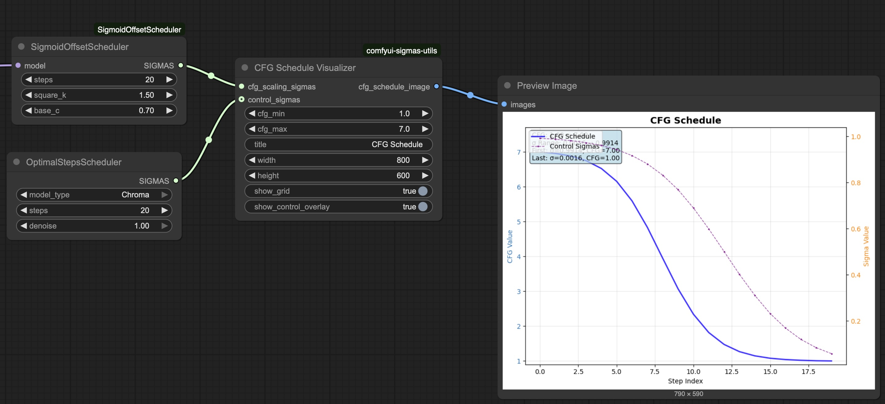

# ComfyUI Sigmas Utils

A collection of ComfyUI custom nodes for visualizing and understanding sigma values in diffusion processes.



*Example: CFG Schedule Visualizer showing how CFG values change across timesteps based on sigma progression*

## Features

### 🎯 Sigma Visualizer
Visualize sigma value distributions with multiple plot types:
- **Line plots**: Show sigma progression across timesteps
- **Scatter plots**: Individual sigma values as points
- **Histograms**: Distribution of sigma values
- **Combined**: Line + scatter overlay

**Inputs:**
- `sigmas` (SIGMAS): Sigma schedule to visualize
- `title` (STRING): Plot title
- `width`/`height` (INT): Plot dimensions
- `show_grid` (BOOLEAN): Grid overlay
- `plot_type`: line | scatter | histogram | both

### 📈 CFG Schedule Visualizer
Visualize how CFG values are interpolated across timesteps based on sigma progression:
- Shows CFG scheduling curve based on [ScheduledGuider](https://github.com/mfg637/ComfyUI-ScheduledGuider-Ext) logic
- Optional control sigma overlay for comparison
- Displays CFG range and sigma statistics
- **Note**: This is a visualization tool - for actual CFG scheduling during sampling, use the [ComfyUI-ScheduledGuider-Ext](https://github.com/mfg637/ComfyUI-ScheduledGuider-Ext) nodes

**Inputs:**
- `cfg_scaling_sigmas` (SIGMAS): Sigma values used for CFG scheduling
- `cfg_min` (FLOAT): Minimum CFG value (used at high sigma/early steps)
- `cfg_max` (FLOAT): Maximum CFG value (used at low sigma/late steps)
- `control_sigmas` (SIGMAS, optional): Additional sigma sequence for overlay
- `show_control_overlay` (BOOLEAN): Toggle control sigma display

**CFG Scheduling Logic:**
- High sigma (early steps) → `cfg_min` (lower guidance)
- Low sigma (late steps) → `cfg_max` (higher guidance)
- Linear interpolation: `cfg = ((cfg_max - cfg_min) * percent + cfg_min)`

## Installation

1. Clone or download this repository to your ComfyUI custom nodes directory:
   ```
   ComfyUI/custom_nodes/comfyui-sigmas-utils/
   ```

2. Install required dependencies:
   ```bash
   pip install matplotlib pillow numpy torch
   ```

3. Restart ComfyUI

## Usage

The nodes will appear in the **"sampling/custom_sampling/sigmas"** category in ComfyUI.

### Basic Workflow
1. Connect a sigma schedule (from any scheduler node) to the visualizer
2. Configure visualization parameters
3. Connect output to a PreviewImage or SaveImage node
4. Run the workflow to generate the visualization

### CFG Schedule Analysis
1. Use CFGScheduleVisualizerNode with your sigma schedule
2. Set desired cfg_min and cfg_max values  
3. Optionally connect a different sigma sequence to control_sigmas for comparison
4. The output shows how CFG values change throughout the sampling process
5. Use this to preview and tune parameters before applying actual CFG scheduling with [ComfyUI-ScheduledGuider-Ext](https://github.com/mfg637/ComfyUI-ScheduledGuider-Ext)

## Examples

- **Compare Schedulers**: Use SigmaVisualizerNode to compare different noise schedules
- **CFG Analysis**: Use CFGScheduleVisualizerNode to understand how guidance changes across timesteps  
- **Schedule Tuning**: Visualize the impact of different sigma distributions on CFG scheduling
- **Parameter Preview**: Test different cfg_min/cfg_max values before using them in actual sampling workflows

## Related Projects

- **[ComfyUI-ScheduledGuider-Ext](https://github.com/mfg637/ComfyUI-ScheduledGuider-Ext)** - Implements the actual CFG scheduling during sampling that this package visualizes

## Dependencies

- ComfyUI
- matplotlib
- PIL (Pillow)
- numpy
- torch

## License

MIT License - see [LICENSE](LICENSE) file for details.